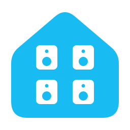

# Local Audio Zones



Use soundcard outputs as separate Music Assistant zones. Choose a device and
stereo pair in Home Assistant's app settings. Music Assistant handles playback,
volume and groups.

## Install

[Add to Home Assistant](https://my.home-assistant.io/redirect/supervisor_addon_repository/?repository_url=https%3A%2F%2Fgithub.com%2Falphasixtyfive%2Flocal-audio-zones)

1. Add `https://github.com/alphasixtyfive/local-audio-zones` to the app store's repositories.
2. Install **Local Audio Zones**.
3. Add zones in **Configuration**, save and restart.

Automatic discovery needs working mDNS on the same local network. You can
also configure a direct server address.
The app is experimental; test your physical outputs before relying on them.

See the [setup guide](local_audio_zones/DOCS.md) and
[hardware notes](docs/audio-hardware-support.md).

For a Linux Docker host, follow the [Docker Compose guide](docs/docker.md).
It uses the same image and settings; multichannel routing needs host PulseAudio.

## Development

```sh
docker build -t local-audio-zones local_audio_zones
scripts/smoke_test.sh local-audio-zones
```

CI builds and checks amd64 and aarch64. A weekly GitHub workflow reports new
stable Sendspin CLI releases as update issues; native upgrades require review.
Dependabot tracks GitHub Actions. To build locally on Home Assistant OS,
copy `local_audio_zones/` to `/addons/local_audio_zones/`, remove `image` from
that copy's `config.yaml` and reload the app store.

## Credits

Based on [Music Assistant Local Audio](https://github.com/music-assistant/local-audio-addon)
and its [native-player update](https://github.com/music-assistant/local-audio-addon/pull/34).
Playback uses [Sendspin](https://github.com/Sendspin/sendspin-cpp-cli).

Licensed under [Apache-2.0](LICENSE). Upstream attribution and dependency
licenses are retained in [NOTICE](local_audio_zones/NOTICE).
